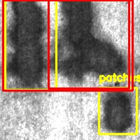

# Metal Surface Defect Detection

A desktop application that detects surface defects on steel strips from BMP images using a custom-trained YOLOv11 object detection model, wrapped in a Tkinter GUI. Built as a final project for a Python course, using the classic NEU steel surface defect dataset as the data source.



## Overview

Steel manufacturers rely on surface inspection to catch defects such as scratches, inclusions, and patches before a coil moves further down the production line. This project explores an automated approach to that inspection step: a YOLOv11 model is trained to localize and classify defects on steel surface images, and a simple desktop GUI lets an operator load an image, run detection, and review the results without touching any code.

## Features

- **Custom-trained YOLOv11 detector** for three defect classes: `inclusion`, `patches`, `scratches`
- **Desktop GUI** (Tkinter) with:
  - A login gate (demo credentials, not intended as real authentication)
  - BMP image upload and preview
  - One-click detection with bounding boxes drawn on the image
  - Overlap-aware box filtering (keeps the largest non-overlapping detections)
  - Severity grading by bounding-box area (Critical / Medium / Minor), color-coded on the image
  - A results table listing detected class, confidence, and severity level
  - A gallery view of previously processed images in the session
  - Live clock / location / temperature display panel (demo values)
- **Standalone packaging**: PyInstaller `.spec` files (`GUI.spec`, `MyApp.spec`, `System.spec`) for building a distributable executable
- **End-to-end scripts**: `train.py` for training and `predict.py` for standalone command-line inference

## Dataset

Two dataset assets are included:

1. **`NEU-Metal-Surface-Defects-Data/`** — the original [NEU surface defect dataset](https://www.kaggle.com/datasets/kaustubhdikshit/neu-surface-defect-database), organized as classification folders across 6 defect types (Crazing, Inclusion, Patches, Pitted, Rolled, Scratches), split into train / valid / test (300 images per class, 1,800 images total).
2. **`metal-surface-defect.v1i.yolov11/`** — a YOLOv11-annotated subset derived from the dataset above and exported via [Roboflow](https://universe.roboflow.com/jensen-fmux4/metal-surface-defect), covering the `inclusion`, `patches`, and `scratches` classes (572 images after augmentation: horizontal flips, 90-degree rotations, and exposure jitter). This is the dataset actually used for training.

## Model & Training

- **Base model**: YOLOv11n (`yolo11n.pt`), fine-tuned with [Ultralytics](https://github.com/ultralytics/ultralytics)
- **Training config**: 100 epochs, image size 640x640, batch size 16 (see `train.py`)
- **Final metrics** (epoch 100, on the validation split, see `runs/detect/train3/results.csv`):

  | Metric | Value |
  |---|---|
  | Precision | 0.834 |
  | Recall | 0.656 |
  | mAP@50 | 0.795 |
  | mAP@50-95 | 0.383 |

  Full training curves, confusion matrix, and per-batch samples are available under `runs/detect/train3/`.

## Project Structure

```
.
├── GUI.py                              # Tkinter desktop application (entry point)
├── predict.py                          # Standalone CLI inference script
├── train.py                            # Training script
├── GUI.spec / MyApp.spec / System.spec # PyInstaller packaging configs
├── yolo11n.pt                          # Pretrained YOLOv11n base weights
├── runs/detect/train3/                 # Training run: weights, metrics, plots
├── metal-surface-defect.v1i.yolov11/   # YOLO-format training dataset (Roboflow export)
├── NEU-Metal-Surface-Defects-Data/     # Original NEU dataset (classification folders)
├── test2.bmp / test3.bmp               # Sample test images
└── output_result_0.jpg                 # Sample detection output
```

## Getting Started

```bash
# 1. Clone the repo
git clone https://github.com/JWcod/metal-surface-defect.git
cd metal-surface-defect

# 2. Install dependencies
pip install -r requirements.txt

# 3. Run the GUI
python GUI.py
```

Login with the demo credentials shown in `GUI.py` (`aaa` / `0000`), then upload one of the sample `.bmp` files and click **Detect**.

To retrain the model from scratch:

```bash
python train.py
```

## Known Limitations

- `GUI.py` and `predict.py` currently point to the model weights and test images via absolute paths from the original development machine. Update the `YOLO(...)` and file paths near the top of each script before running them in a different environment.
- The login screen uses hardcoded demo credentials for the sake of the class assignment; it is not a real authentication mechanism.
- A few sidebar actions (`Export CSV`, `Export Report`, `Camera Settings`, `Calibration Wizard`) are UI stubs left for future work.

## Acknowledgments

- Dataset: NEU Surface Defect Database, Northeastern University
- Dataset annotation/export: [Roboflow](https://roboflow.com)
- Model framework: [Ultralytics YOLO11](https://github.com/ultralytics/ultralytics)

## License

This project is shared for educational and portfolio purposes. The NEU dataset subset exported via Roboflow is licensed under [CC BY 4.0](https://creativecommons.org/licenses/by/4.0/).
